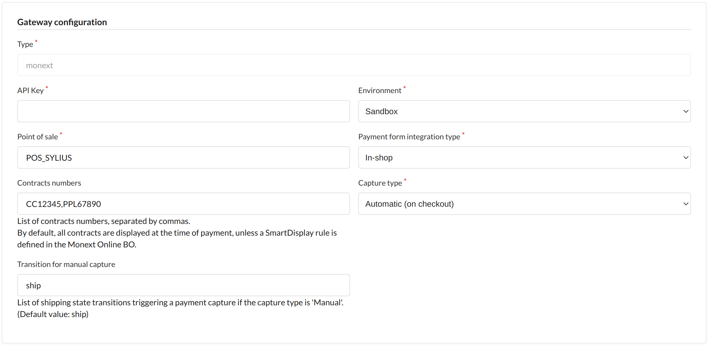

# [](https://www.monext.fr/)

# Monext Sylius Plugin

----

## Table of Content

* [Overview](#overview)
* [Features](#features)
* [Installation](#installation)
  * [Requirements](#requirements)
  * [Installation process](#installation-process)
* [Configuration](#configuration)
* [Additional resources for developers](#additional-resources-for-developers)
* [License](#license)
* [Contact and support](#contact-and-support)

## Overview

This plugin allows you to use the Monext payment system with a Sylius ecommerce application.

## Features

This plugin integrate with native Sylius orders' workflow and provides the following features:

* Do offsite payment on a payment page hosted by Monext.
* Do in-shop payment through Monext-hosted iframe.
* Choose between immediate capture or only triggered by a specific order state (like capture at shipping).
* Cancel payments (not partials).
* Refund payments (not partials).

**Note:** This plugin does not use features from Sylius Plus.


### Supported payment methods

This plugin supports the following payment methods:

* CB
* Visa
* Mastercard
* American Express
* ApplePay
* GooglePay
* Paypal
* Bancontact
* iDEAL
* Klarna
* Multibanco
* MB Way

You can also check [our documentation](https://docs.monext.fr/display/DT/Payment+Method) for more information about other supported payment methods.

## Installation

### Requirements

| Package                | Version      |
|------------------------|--------------|
| PHP                    | ^8.3         |
| ext-json:              | *            |
| sylius/resource-bundle | ^1.10        |
| sylius/sylius          | ^1.12        |
| symfony/messenger      | ^5.4 or ^6.4 |

**Important note:** This plugin makes heavy use of the `details` field in the `sylius_payment` entity. Make sure you don't use this field or please contact us to see how we can work around this.

### Installation process

1. Simply add the plugin to your project:

```bash
composer require monext/monext-sylius
```

2. Add plugin dependencies to your `config/bundles.php` file by adding this line to the end of the array (if it does not already exist) :

```php
    MonextSyliusPlugin\MonextSyliusPlugin::class => ['all' => true]
```

3. Then add this line to `templates/bundles/SyliusShopBundle/Checkout/SelectPayment/_choice.html.twig`:

```diff 
@@ -14,5 +14,8 @@
        
            {{ render(controller('Sylius\\PayPalPlugin\\Controller\\PayPalButtonsController::renderPaymentPageButtonsAction', {'orderId': order.id})) }}
        
+        
+            {{ render(controller('MonextSyliusPlugin\\Controller\\Shop\\MonextController::renderPaymentMethodAction', {'orderId': order.id})) }}
+        
    </div>
</div>
```

4. Finally, in `config/packages/_sylius.yaml` add this to the `imports` section:

```yaml
    - { resource: "@MonextSyliusPlugin/Resources/config/config.yaml" }
```

5. Clear cache and run migrations:

```bash
bin/console cache:clear
bin/console doctrine:migration:migrate
```

6. Log into the Sylius admin area, then click on the left menu item "CONFIGURATION > Payment methods". There you can add a new payment method of type "Monext".

## Configuration

Here are the main configuration fields for the payment method:

* API KEY:
  * Base64-encoded API credentials.
* Point of sale:
  * Recommended to use one per Sylius channel. It's the Monext's point of sale linked to the payments processed by this method.
* Environment:
  * Sandbox for debug and test purpose.
  * Production for real payment.
    * You need to carry out 'pilot' transactions to validate that they are working properly in production.
* Payment form integration type:
  * Redirection (offsite).
  * In-shop.
* Contract numbers (optional):
  * Comma-separated list of your enabled Monext payment contracts that should be used.
  * If no value is provided, all contracts are displayed, unless a SmartDisplay rule is defined in the Monext Online BO.
* Capture type:
  * Automatic: Authorization + Capture are immediately done.
  * Manual: Only Authorization is immediate, Capture should be either done manually or will be triggered by a specific transition in shipping states.
* Transition for manual capture:
  * Comma-separated list of *transitions* in the Winzou state manager used for triggering a manual capture.

---



## Additional resources for developers

To learn more about how the API used by the plugin and how to modify or use Sylius with it to fit your needs:
* [Sylius Plugin Monext documentation](https://docs.monext.fr/display/DT/Sylius+Plugin)
* [Monext API documentation](https://api-docs.retail.monext.com/reference/getting-started-with-your-api)
* [Sylius 1.12 Documentation](https://old-docs.sylius.com/en/1.12/)
* [Sylius Online Course](https://sylius.com/online-course/)

## License

This plugin's source code is completely free and released under the terms of the MIT license.

## Contact and support

If you want to contact us, the best way is through [this page on our website](https://www.monext.fr/gardons-le-contact) and send us your question(s).

We guarantee that we answer as soon as we can!

If you need support you can also directly check our FAQ section and contact us [on the support page](https://support.payline.com/hc/fr).
